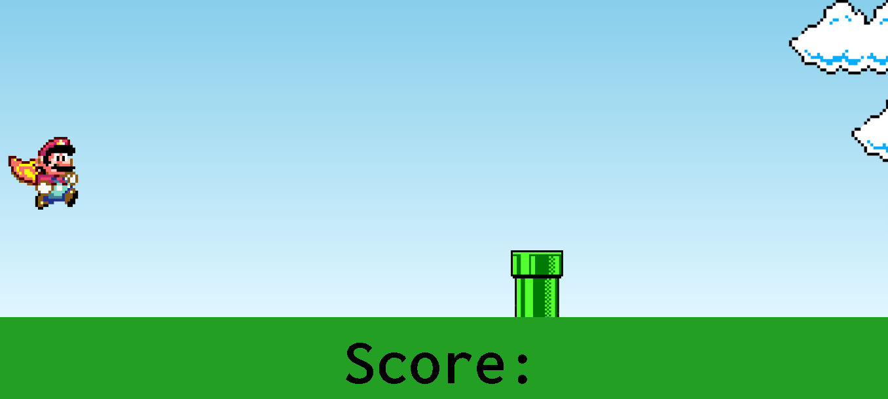
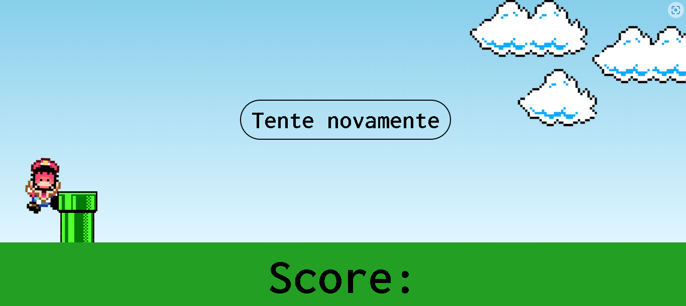

## Table of contents

- [Overview](#overview)
  - The challenge is to build out this a Mario game using DOM.
  - 
  - [Links](#links)
- My process: It took me 3 days to build this.
  - Built with: HTML5, CSS3 and JAVASCRIPT.
  - What I learned: I've learned how to use DOM and animations on CSS.
  - Continued development: I have to continue practice how to use the responsive page and Javascript. 
  - Useful resources: https://www.horadecodar.com.br/2021/04/02/como-recarregar-a-pagina-com-javascript-refresh/ 
  https://youtu.br/r9buAwVBDhA 
- Author: Natali Marinho. 
- Acknowledgments: javascript, css and html.


### The challenge

Users should be able to:

- Play Mario game
- Reload the page
- See your score

### Screenshot





## My process

### Built with

- Semantic HTML5 markup
- CSS custom properties
- Flexbox
- DOM
- Mobile-first workflow


### What I learned


```css
@keyframes pipe-animation {
    from{
        right: -8rem;
    }
    to {
        right: 100%;
    }
}

@keyframes jump {
    0% {
        bottom: 0;
    }

    40%{
        bottom: 18rem;
    }

    50%{
        bottom: 18rem;
    }

    60%{
        bottom: 18rem;
    }

    100%{
        bottom: 0;
    }
}
```
```js
const jump = () => {
    mario.classList.add('jump')

    setTimeout(() => {
    mario.classList.remove('jump')
    


const marioPosition = +window.getComputedStyle(mario).bottom.replace('px', '')

const btnReload = document.getElementById('recarregar')
btnReload.addEventListener('click', recarrega)

function recarrega(){
    location.reload();
}

document.addEventListener('keydown', jump)
```

### Continued development

I want to learn more javascript and DOM

## Author

- Frontend Mentor - [@natsmarinho](https://www.frontendmentor.io/profile/natsmarinho)
- Twitter - [@friidakhalo](https://www.twitter.com/friidakhalo)
- Instagram - [@natsmarinho](https://www.instagram.com/natsmarinho/)
